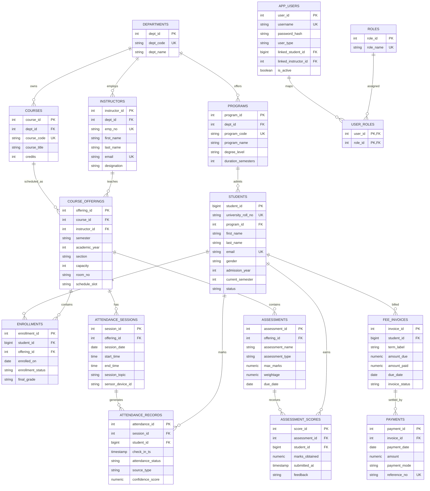

# Smart Student Management System with Analytics

## 1. Problem Statement

Universities manage student records, course registrations, attendance, assessments, fee payments, and performance reporting across multiple departments. In many institutions, these activities are distributed across spreadsheets, manual registers, and disconnected applications. This creates data duplication, poor traceability, delayed reporting, and difficulty in decision-making.

The proposed Smart Student Management System with Analytics is a centralized DBMS project that integrates academic administration, attendance tracking, assessment evaluation, fee monitoring, and analytical reporting. The system combines a normalized relational database for transactional consistency with a small NoSQL component for high-volume attendance sensor logs.

## 2. Objectives

- Maintain a single source of truth for students, instructors, departments, programs, courses, and enrollments
- Track attendance at session level using simulated IoT sensor events
- Store and analyze assessment scores and final grades
- Manage student fee invoices and payments
- Support secure role-based access for admins, faculty, and students
- Provide analytical SQL queries, views, ranking, and reporting
- Demonstrate normalization, indexing, transactions, ACID behavior, and query optimization

## 3. Stakeholders and Database Users

- University admin: manages departments, programs, users, and policies
- Registrar office: creates course offerings and oversees enrollments
- Faculty: records attendance, assessments, and grades
- Finance office: manages invoices and payments
- Students: view their academic and fee status
- Management: consumes analytics for decision-making
- Database administrator: manages security, backup, indexing, and performance

## 4. DBMS Architecture

This project uses a client-server architecture.

- Client layer: web or desktop front-end, faculty portal, student portal, reporting dashboard
- Application layer: business rules, authentication, API, validation
- Database layer: PostgreSQL for normalized transactional data and MongoDB for sensor/event logs

Why client-server is appropriate:

- Centralized control over consistency and security
- Easy multi-user access from faculty, admin, and students
- Better fit for ACID transactions in course registration and payments
- Simple integration of operational PostgreSQL with event-oriented MongoDB

## 5. Scope of the System

### Core Modules

- Student and program management
- Course and instructor management
- Course offerings and enrollments
- Session-wise attendance
- Assessments and score recording
- Fee invoicing and payment tracking
- Role-based user access

### Advanced Module

IoT attendance simulation is used as the advanced DBMS feature. Attendance events are produced by a Python script and stored in MongoDB before being summarized or reconciled with the PostgreSQL attendance tables.

## 6. ER Model



## 7. Constraints

### Entity Integrity

- Every table has a primary key
- Keys are non-null and unique by definition

### Referential Integrity

- Foreign keys connect students to programs, offerings to courses and instructors, payments to invoices, and scores to assessments
- `ON DELETE RESTRICT` or `ON DELETE CASCADE` is used depending on data semantics

### Domain Integrity

- `CHECK` constraints validate credits, semester numbers, positive amounts, confidence range, and allowed status values
- `UNIQUE` constraints prevent duplicates for roll numbers, emails, course codes, and references

## 8. Relational Schema

```text
DEPARTMENTS(dept_id PK, dept_code UK, dept_name)
PROGRAMS(program_id PK, dept_id FK, program_code UK, program_name, degree_level, duration_semesters)
STUDENTS(student_id PK, university_roll_no UK, program_id FK, first_name, last_name, gender, dob, email UK, phone, admission_year, current_semester, status)
INSTRUCTORS(instructor_id PK, dept_id FK, emp_no UK, first_name, last_name, email UK, designation)
COURSES(course_id PK, dept_id FK, course_code UK, course_title, credits)
COURSE_OFFERINGS(offering_id PK, course_id FK, instructor_id FK, semester, academic_year, section, capacity, room_no, schedule_slot, UNIQUE(course_id, semester, academic_year, section))
ENROLLMENTS(enrollment_id PK, student_id FK, offering_id FK, enrolled_on, enrollment_status, final_grade, UNIQUE(student_id, offering_id))
ATTENDANCE_SESSIONS(session_id PK, offering_id FK, session_date, start_time, end_time, session_topic, sensor_device_id, UNIQUE(offering_id, session_date, start_time))
ATTENDANCE_RECORDS(attendance_id PK, session_id FK, student_id FK, check_in_ts, attendance_status, source_type, confidence_score, UNIQUE(session_id, student_id))
ASSESSMENTS(assessment_id PK, offering_id FK, assessment_name, assessment_type, max_marks, weightage, due_date, UNIQUE(offering_id, assessment_name))
ASSESSMENT_SCORES(score_id PK, assessment_id FK, student_id FK, marks_obtained, submitted_at, feedback, UNIQUE(assessment_id, student_id))
FEE_INVOICES(invoice_id PK, student_id FK, term_label, amount_due, amount_paid, due_date, invoice_status, UNIQUE(student_id, term_label))
PAYMENTS(payment_id PK, invoice_id FK, payment_date, amount, payment_mode, reference_no UK)
APP_USERS(user_id PK, username UK, password_hash, user_type, linked_student_id FK, linked_instructor_id FK, is_active)
ROLES(role_id PK, role_name UK)
USER_ROLES(user_id PK/FK, role_id PK/FK)
```

## 9. Functional Dependencies

Representative functional dependencies are:

- `dept_id -> dept_code, dept_name`
- `program_id -> dept_id, program_code, program_name, degree_level, duration_semesters`
- `student_id -> university_roll_no, program_id, first_name, last_name, gender, dob, email, phone, admission_year, current_semester, status`
- `instructor_id -> dept_id, emp_no, first_name, last_name, email, designation`
- `course_id -> dept_id, course_code, course_title, credits`
- `offering_id -> course_id, instructor_id, semester, academic_year, section, capacity, room_no, schedule_slot`
- `(course_id, semester, academic_year, section) -> offering_id, instructor_id, capacity, room_no, schedule_slot`
- `enrollment_id -> student_id, offering_id, enrolled_on, enrollment_status, final_grade`
- `(student_id, offering_id) -> enrollment_id, enrolled_on, enrollment_status, final_grade`
- `assessment_id -> offering_id, assessment_name, assessment_type, max_marks, weightage, due_date`
- `(assessment_id, student_id) -> marks_obtained, submitted_at, feedback`
- `invoice_id -> student_id, term_label, amount_due, amount_paid, due_date, invoice_status`
- `payment_id -> invoice_id, payment_date, amount, payment_mode, reference_no`

## 10. Normalization

### Unnormalized Situation

If student registration, courses, marks, and payments are stored in a single table, repeating groups appear:

`Student(student_roll, student_name, program, course1, course2, course3, marks1, marks2, invoice1, payment1, payment2, ...)`

Problems:

- Repeating attributes
- Update anomalies
- Insert anomalies
- Delete anomalies

### First Normal Form (1NF)

1NF requires atomic values and no repeating groups. Separate tables are formed for:

- Students
- Courses
- Enrollments
- Assessments
- Payments

Each attribute becomes single-valued.

### Second Normal Form (2NF)

2NF removes partial dependency on composite keys.

Example:

- In `ENROLLMENTS(student_id, offering_id, student_name, course_title, final_grade)`, `student_name` depends only on `student_id` and `course_title` depends only on `offering_id`
- Therefore student and course details are moved to `STUDENTS` and `COURSE_OFFERINGS/COURSES`

### Third Normal Form (3NF)

3NF removes transitive dependency.

Example:

- In `STUDENTS(student_id, program_id, program_name, dept_name, ...)`, `program_name` depends on `program_id`, not directly on `student_id`
- `PROGRAMS` and `DEPARTMENTS` are separated

Another example:

- In `INSTRUCTORS(instructor_id, dept_id, dept_name, ...)`, `dept_name` is moved to `DEPARTMENTS`

### Boyce-Codd Normal Form (BCNF)

BCNF requires every determinant to be a candidate key.

Examples:

- `COURSE_OFFERINGS`: both `offering_id` and `(course_id, semester, academic_year, section)` functionally determine the rest; both are candidate keys because the second is enforced as unique
- `ASSESSMENT_SCORES`: only `(assessment_id, student_id)` determines score details and is enforced unique

The final schema is in BCNF for the intended operational rules.

## 11. SQL Implementation Summary

Implementation files:

- Schema and constraints: [sql/01_schema.sql](C:/Users/anayd/OneDrive/Desktop/dbms_project/sql/01_schema.sql)
- Sample data: [sql/02_sample_data.sql](C:/Users/anayd/OneDrive/Desktop/dbms_project/sql/02_sample_data.sql)
- Advanced SQL and analytics: [sql/03_analytics_queries.sql](C:/Users/anayd/OneDrive/Desktop/dbms_project/sql/03_analytics_queries.sql)
- Indexing, transactions, and security: [sql/04_admin_features.sql](C:/Users/anayd/OneDrive/Desktop/dbms_project/sql/04_admin_features.sql)

## 12. Advanced SQL Coverage

The project includes:

- INNER JOIN for student-course-program analysis
- LEFT JOIN for students with or without payments
- RIGHT JOIN for offerings and enrollment presence
- FULL JOIN for invoice-payment reconciliation
- Subqueries for top performers and underperformers
- Views for academic and attendance summaries
- Window functions using `ROW_NUMBER()` and `RANK()`

## 13. Indexing and Query Optimization

Indexes are created on:

- Foreign key columns used in joins
- Search columns such as roll number, course code, and dates
- Attendance and score tables used for analytics

Optimization rationale:

- Enrollment analytics frequently join `student_id`, `offering_id`, and `assessment_id`
- Attendance reporting filters by `session_date`, `offering_id`, and `student_id`
- Fee reconciliation filters by invoice and payment relationships

Typical performance strategy:

- Use selective indexes on high-frequency join/filter columns
- Avoid `SELECT *` in reports
- Precompute reusable summaries using views
- Use `EXPLAIN ANALYZE` to confirm index scans and join strategy

## 14. Transactions and ACID

### Atomicity

Course registration should either complete fully or not happen at all. If enrollment is created but fee allocation fails, the transaction is rolled back.

### Consistency

Constraints ensure only valid data enters the system. Examples include positive credits, valid semester range, unique enrollment, and valid foreign keys.

### Isolation

Concurrent registration transactions should not overbook course capacity. Row-level locking using `FOR UPDATE` can protect critical rows.

### Durability

Once `COMMIT` succeeds, the database preserves the enrollment or payment record even if the client disconnects.

Transaction samples are included in [sql/04_admin_features.sql](C:/Users/anayd/OneDrive/Desktop/dbms_project/sql/04_admin_features.sql).

## 15. NoSQL Integration

MongoDB stores raw attendance events from IoT devices:

- high-volume sensor pings
- semi-structured metadata
- device battery/network diagnostics
- irregular event payloads

Why NoSQL is useful here:

- Event schema may evolve over time
- Large append-heavy logs are better handled separately from normalized transactional tables
- Raw sensor data can be retained for audit and anomaly analysis without bloating relational tables

MongoDB artifacts:

- [nosql/mongodb_attendance_logs.js](C:/Users/anayd/OneDrive/Desktop/dbms_project/nosql/mongodb_attendance_logs.js)
- [scripts/iot_attendance_simulation.py](C:/Users/anayd/OneDrive/Desktop/dbms_project/scripts/iot_attendance_simulation.py)

## 16. Security Design

### Authentication

- Application users are stored in `app_users`
- Passwords are stored only as hashes, never plain text
- In production, use bcrypt, Argon2, or PBKDF2 from the application layer

### Authorization

- Roles such as `admin`, `faculty`, `student`, `finance_officer` are defined
- `user_roles` maps users to roles
- PostgreSQL roles can additionally restrict read/write permissions by module

### Basic Encryption Concept

- Data in transit should use TLS between client and database
- Sensitive fields such as password hashes and payment references should be protected
- Highly sensitive data can be encrypted at application level before insertion

## 17. Sample Query Outputs

### Student GPA-style Ranking by Weighted Percentage

```text
 student_roll  | student_name    | weighted_percentage | class_rank
---------------+-----------------+---------------------+-----------
 22CSE001      | Aisha Sharma    | 86.50               | 1
 22CSE002      | Rohan Mehta     | 81.25               | 2
 22ECE001      | Neha Verma      | 78.00               | 3
 22CSE003      | Arjun Rao       | 68.50               | 4
```

### Attendance Summary

```text
 course_code | student_roll | sessions_held | sessions_present | attendance_pct
-------------+--------------+---------------+------------------+---------------
 CS301       | 22CSE001     | 2             | 2                | 100.00
 CS301       | 22CSE002     | 2             | 2                | 100.00
 CS301       | 22CSE003     | 2             | 1                | 50.00
 EC201       | 22ECE001     | 1             | 1                | 100.00
```

### Fee Status

```text
 student_roll | term_label   | amount_due | amount_paid | balance | invoice_status
--------------+--------------+------------+-------------+---------+---------------
 22CSE001     | 2025-ODD     | 45000.00   | 45000.00    | 0.00    | PAID
 22CSE002     | 2025-ODD     | 45000.00   | 25000.00    | 20000.00| PARTIAL
 22CSE003     | 2025-ODD     | 45000.00   | 0.00        | 45000.00| UNPAID
```

## 18. Assumptions

- Semesters are represented as `ODD`, `EVEN`, and `SUMMER`
- Final grades are stored after term completion
- Weighted percentage is calculated from assessments and not from external GPA rules
- IoT events are logged in MongoDB and then reconciled with PostgreSQL attendance tables through ETL or admin review

## 19. Conclusion

This project demonstrates a full DBMS lifecycle: problem analysis, ER modeling, normalization, relational implementation, advanced SQL, indexing, transactions, security, and hybrid SQL-NoSQL integration. It is suitable for a final-year DBMS submission because it combines strong theoretical grounding with practical implementation detail.
